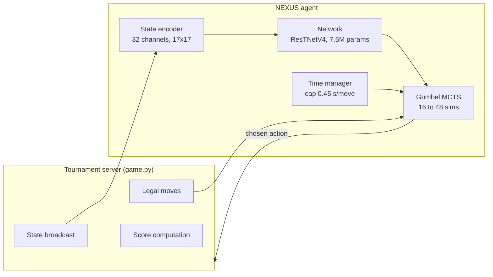
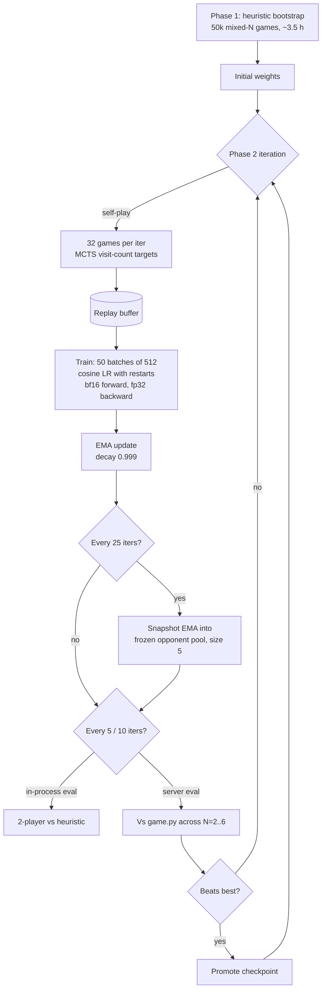
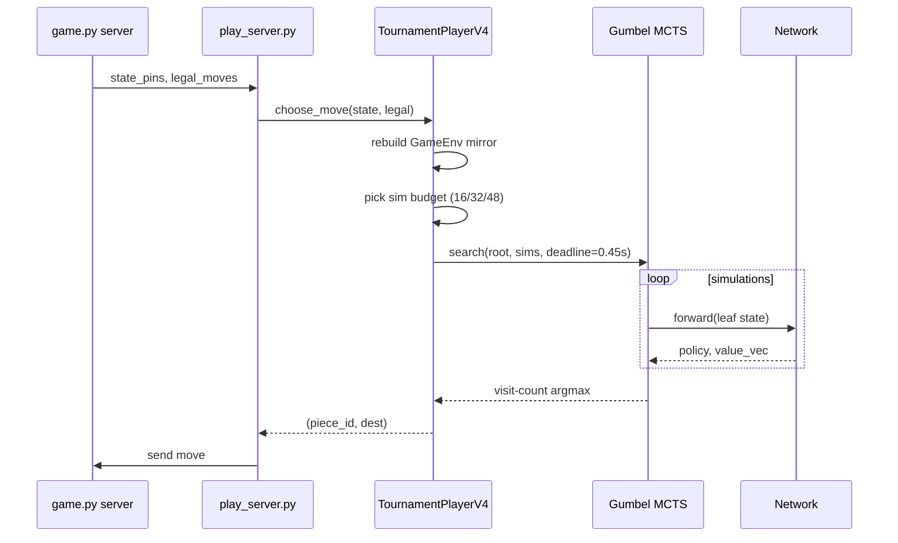

# NEXUS

A reinforcement-learning agent for N-player Chinese Checkers (N from 2 to 6),
built on an AlphaZero-style training loop with Gumbel MCTS, per-player value
backup, and a KataGo-style nested-bottleneck residual backbone. The agent
connects to the course tournament server over TCP/JSON-RPC and competes on the
authoritative scoring formula (`pin_goal_score + distance_score + time_score +
move_score`).

## Contents

1. [What it does](#what-it-does)
2. [System overview](#system-overview)
3. [Network architecture](#network-architecture)
4. [Game environment](#game-environment)
5. [Training pipeline](#training-pipeline)
6. [Tournament inference](#tournament-inference)
7. [Repository layout](#repository-layout)
8. [Quick start](#quick-start)
9. [Research subprojects](#research-subprojects)
10. [References](#references)

## What it does

The agent plays Chinese Checkers against the official server, with these goals:

* Match the server's rule set exactly so self-play data is on-distribution.
* Win as many games as possible across all supported player counts.
* Stay fast: the time component of the score caps at 100 and decays at roughly
  one point per second, so a slow agent loses 50 to 100 points per game.
* Survive network jitter and recover cleanly from partial state.

The training environment in `core/game_env.py` mirrors the server's move
generation, win condition, draw rule, time cap, score formula, color seating,
and turn rotation. Conformance is checked by tests in `tests/`.

## System overview



The encoder turns the raw `state_pins` and the agent's seat into a 32-channel
hex tensor. The network produces a policy prior, a per-player value vector,
and several auxiliary heads. MCTS uses the prior and the value head to explore,
with sequential halving over Gumbel-perturbed candidates. The time manager
shrinks the simulation budget if the previous move went over budget.

## Network architecture

`network/model_v4.py` defines `ResTNetV4`, a hybrid convolutional/transformer
backbone:

```
Input (B, 32, 17, 17)
   |
   |-- 1x1 Conv 32 -> 256
   |
   |-- 8 x NBT block          NBT = [1x1 down 256->128, 3x3, 3x3, 1x1 up 128->256]
   |                           with inner residual on the 3x3 pair
   |
   |-- Flatten valid hexes -> Transformer (8-head, 1024-d FFN, 1 layer)
   |   re-projected back onto the spatial grid + residual
   |
   |-- 8 x NBT block
   |
   |-- Global average pool over valid cells
   |
   v
Representation (B, 256) --> seven heads
```

Output heads:

| Head           | Shape          | Purpose                                                |
| -------------- | -------------- | ------------------------------------------------------ |
| `policy`       | `(B, 1210)`    | Action distribution over 10 pieces times 121 cells     |
| `value`        | `(B,)`         | Current player's slot of `value_vec` (compatibility)   |
| `value_vec`    | `(B, 6)`       | Per-player normalized expected score in [-1, 1]        |
| `opp_logits`   | `(B, 1210)`    | Predicted next opponent move (auxiliary)               |
| `plies`        | `(B,)`         | Plies remaining, regressed against `target / 200`      |
| `score_margin` | `(B, 6)`       | Per-seat (score minus mean of others) divided by 1300  |
| `pin_final`    | `(B, 10, 5)`   | Per-pin distance bucket at game end                    |

Total parameters: 7.5M. Forward pass on one GPU is roughly 8.5 ms.

The 32-channel encoder packs:

* Channels 0 to 7: own pieces, all opponents unioned, own and opponent goal
  zones, own and opponent start zones, empty cells, board mask.
* Channels 8 to 17: per-piece distance to goal (one channel per pin).
* Channel 18: pieces with a one-move landing in goal.
* Channel 19: N divided by 6, broadcast.
* Channel 20: own move count divided by 100.
* Channel 21: in-goal pin fraction.
* Channels 22 to 31: per-opponent slots (5 opponents times {pieces, goal zone}),
  keyed by relative seat offset (slot 0 is the next-to-move opponent).

## Game environment

`core/game_env.py` is verified rule-equivalent to the server's `game.py`:

* Move generation, including multi-hop chains, matches `checkers_pins.getPossibleMoves`.
* Win: all 10 pins on opposite-color goal cells.
* Stuck and draw detection: stateless re-check via current legal moves.
* `(N - 1)` stuck rule: exactly one live mover means that player wins.
* Time cap: `GAME_TIME_LIMIT_SEC = 60`.
* Score formula in `core/teacher_score.py` mirrors `compute_scores` bit for bit.
* Color seating: randomized in primary plus complement pairs.
* Turn order: `COLOUR_ORDER` filtered by colors present.

## Training pipeline



* **Phase 1** is heuristic-bootstrapped supervised pretraining. Each seat is
  the heuristic agent (greedy distance plus hop bonus). The network is trained
  via cross-entropy on the heuristic's actions plus all auxiliary targets.
* **Phase 2** is real AlphaZero self-play. Each move runs MCTS with 16
  simulations and m=4 Gumbel candidates; the visit-count distribution is the
  policy target. Auxiliary targets are filled from terminal state.
* The frozen opponent pool injects diversity: 25% of self-play games include
  one frozen seat sampled from the pool.
* Full trainer state (weights, optimizer, scheduler, EMA, replay buffer,
  frozen pool, counters) is checkpointed every 5 iterations for crash recovery.

Loss in `training/losses_v4.py`:

```
L = L_policy(MCTS-improved targets)
  + 0.50 * L_value_vec
  + 0.15 * L_opp_policy
  + 0.10 * L_plies
  + 0.50 * L_score_margin
  + 0.30 * L_pin_final
  + 0.30 * L_kl(old policy)        # only when an older snapshot exists
  - 0.005 * H(policy)              # entropy bonus
```

All loss heads are NaN-guarded against all-illegal-mask edge cases.

## Tournament inference



Sim budgets are picked by ply: opening up to 48, midgame 32, endgame 16.
The wall-clock cap is hard: a watchdog reduces the next call's sim count if
the previous call exceeded 0.45 s. Subtree reuse keeps tree work between
moves of the same game (`advance_root(root, action)`).

If MCTS raises an exception at runtime, the agent falls through to the raw
network policy; if that also fails, it falls back to the heuristic.

## Repository layout

```
nexus/
  README.md
  config.py            All hyperparameters in one place.
  requirements.txt
  Makefile             Convenience targets for tests, smoke, env checks.

  core/                Game environment, board geometry, score formula.
  network/             Network architectures and heads.
  mcts/                Gumbel MCTS with sequential halving.
  training/            Phase 1 / Phase 2 trainers, losses, replay buffer.
  inference/           Tournament-time agent and time manager.
  scripts/             Training launchers, evaluation, server client.
  tests/               Unit and integration tests.

  decomposed_mcts/         Subproject: CMAZ component-mixed AlphaZero.
  equivariant_net/         Subproject: wreath-product equivariant network.
  flagship_coalition_mcts/ Subproject: coalition-distributional MCTS.
  RLChineseCheckers/       Authoritative server reference (read-only).

  checkpoints_v4/      Trained agent weights.
  check_env.py         Python and GPU sanity check.
  repro.sh             Reproduction script.
  run_all_tests.sh     Test runner across all subprojects.
  validate_repo.sh     Repo health check.
```

## Quick start

```bash
python -m venv venv
source venv/bin/activate
pip install -r requirements.txt

# Sanity check
python check_env.py

# Run tests
./run_all_tests.sh

# Phase 1 bootstrap (single GPU, ~3.5 h)
python scripts/train_phase1_v4.py

# Phase 2 self-play
python scripts/train_phase2_v4.py --resume checkpoints_v4/phase1_v4.pt

# Play in tournament
python scripts/play_server.py \
  --model checkpoints_v4/phase2_best_by_eval2p.pt \
  --host <server-host> --port <server-port> \
  --name NEXUS
```

The included checkpoint `checkpoints_v4/phase2_best_by_eval2p.pt` is a
training-state snapshot suitable for head-to-head evaluation.

## Research subprojects

Three independent research efforts live alongside the main agent:

* `flagship_coalition_mcts/`: Coalition-Distributional MCTS for N-player
  non-zero-sum games, using Plackett-Luce rank-distribution value heads,
  state-conditional coalition belief posteriors, and EXP-IX no-regret action
  selectors.
* `decomposed_mcts/` (CMAZ): a state-conditional QMIX-style monotonic mixer
  over per-objective values, with inference-time utility re-weighting.
* `equivariant_net/`: a C6 wr S_N wreath-product equivariant network for
  star-hex Chinese Checkers, with bit-identical seat permutation invariance
  and ASEN-style active-subgroup gating.

Each subproject has its own `README.md`, tests, and experiments directory.

## References

* Danihelka, Guez, Schrittwieser, Silver. *Policy improvement by planning with
  Gumbel*, ICLR 2022. <https://openreview.net/forum?id=bERaNdoegnO>
* Schrittwieser et al. *Online and offline reinforcement learning by planning
  with a learned model*, NeurIPS 2021. <https://arxiv.org/abs/2104.06294>
* Petosa, Balch. *Multiplayer AlphaZero*, NeurIPS DeepRL Workshop 2019.
  <https://arxiv.org/abs/1910.13012>
* Wu. *Accelerating Self-Play Learning in Go*, 2019.
  <https://arxiv.org/abs/1902.10565>
* He et al. *Efficient Learning in Chinese Checkers*, 2024.
  <https://arxiv.org/abs/2405.18733>
* Busbridge et al. *How to Scale Your EMA*, NeurIPS 2023.
